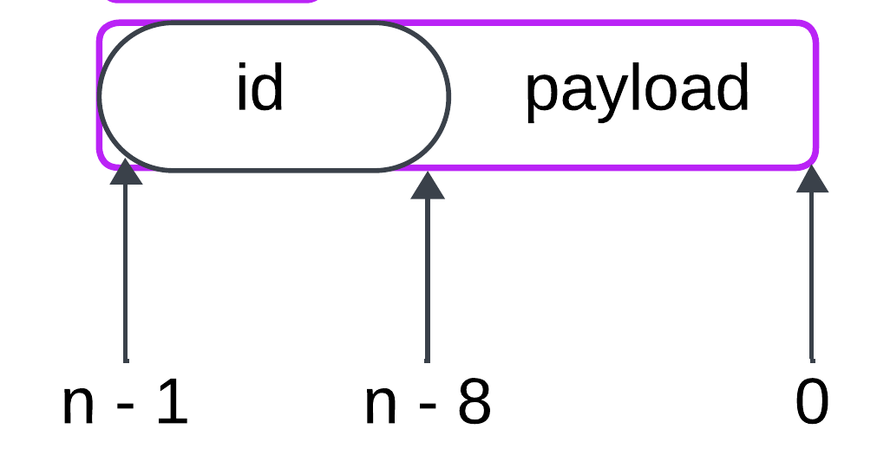
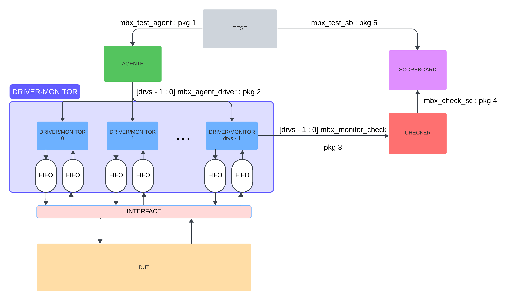
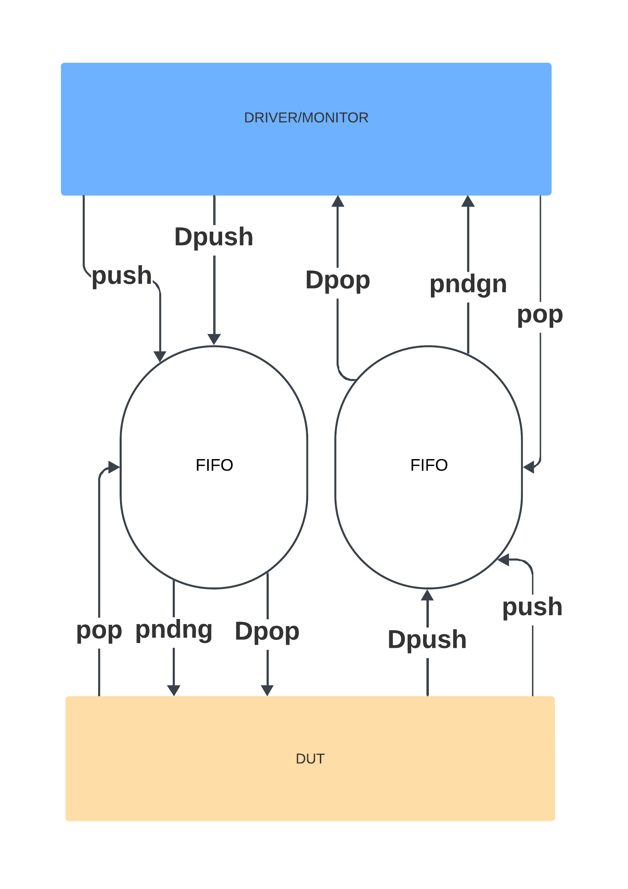

# Test Plan para la verificación del Bus Driver

## 1. Descripción del DUT

Para el diseño del ambiente de verificación, se toma en cuenta el funcionamiento del dispositivo, que en este caso es un manejador de bus de datos que permite la transmisión de información entre diferentes periféricos. Estos periféricos serán emulados mediante FIFOs, y el objetivo específico es verificar el correcto funcionamiento del bus. Las FIFOs serán descritas a nivel de software y los datos transmitidos serán definidos como específicos o aleatorios, dependiendo del tipo de prueba que se ejecute.

### Módulos Principales
1. **Bus driver**: DUT, se encarga de administrar el acceso de distintos periféricos al bus de datos.
2. **Dispositivos FIFO**: estos almacenan datos temporalmente, en este caso es la interfaz de conexión entre el DUT y el ambiente de verificación.

### Señales 

- pndng: si la fifo está vacía la señal de pndng es 0.
- push: señal de control que indica que se debe realizar una operación de push (es decir, ingresar datos a la FIFO). 
- pop: señal de control que indica que se debe realizar una operación de pop (es decir, sacar datos de la FIFO). 

    
- Dpush: datos a ser almacenados en la FIFO.
- Dpop: datos a ser extraídos de la FIFO. 
- broadcast: Representa una señal con un valor por defecto de 8 bits (todo 1s: 11111111). Esto significa que el módulo tiene una funcionalidad de transmisión de mensajes a múltiples destinatarios simultáneamente (broadcast).

## 2. Escenarios
### 2.1 Casos generales

Como casos generales o de uso común se tienen las pruebas con cada transacción:

- **Enviar datos**: cada periférico debe poder enviar un paquete a otro periférico a través del bus de datos.

- **Recepción de datos enviados**: si se envía un paquete a cierto periférico, este debe recibirlo dado su ID, el payload debe coincidir con el enviado.

- **Funcionamiento del reset**: ....

- **Broadcast**: si un periférico realiza broadcast con el identificador 8´d1, todos los periféricos deben recibir el payload enviado.

### 2.2 Casos de esquina

- **Overflow**: Consiste en un caso donde una FIFO se le hará push, pero ya está llena.

- **Underflow**: Consiste en un caso donde una FIFO está vacía y se quiere hacer una lectura.

- **Varios envían a la vez**: Este caso probará el comportamiento del bus al enviar datos por varios periférico a la vez
- **Todos envían a la vez**: Este caso probará el comportamiento del bus al enviar datos por cada periférico a la vez
- **Se envía un paquete con un id ilegal**: Con determinado número de periféricos, se utilizará un número o ID que no existe.
- **Todos hacen broadcast simultaneamente**: Similar al caso de enviar todos a la vez, solo que con broadcast.
- **Varios hacen broadcast**: Busca probar mportamiento del bus al recibir varios broadcast 
- **Se envía a sí mismo**: Este caso consiste en sacar un dato de un periférico para volver a enviarlo al mismo.
- **Uno solo envía una ráfaga de paquetes**: Busca probar el comportamiento del dispositivo al enviar datos de forms exhaustiva.
- **Todos le envían al mismo simultaneamente**: Medirá la capacidad de los periféricos al recibir datos exhaustivamente.
- **Reset cuando no se ha terminado una transacción**: El comportamiento esperado es que vacíe el dispositivo, dejándolo sin datos. Por lo que anularía las transacciones hasta dicho momento.

## 3. Aleatorización

Además de esto, como parte de las pruebas, se aleatorizarán distintas variables del test:

- **Número de transacciones**: se pobrarán cantidades distintas de transacciones.

- **Largo de paquetes**: se aleatorizará el largo de los paquetes entre 16, 32 y 64 bits.

- **Tiempo de espera entre eventos**: Para las distintas transacciones se aleatorizarán los tiempos de retardo.

- **Cantidad de periféricos**: El dispositivo al ser capaz de tener diferente cantidad de periféricos, podría tener comportamientos distintos.
- **Dimensión de profundidad en la FIFO**: Los periféricos pueden tener tamaños distintos, lo ideal sería un comportamiento sin cambios.
- **Tipos de transacciones**: Las transacciones pueden ir en distinto órden y cantidad, cada una realiza distintas acciones.
- **Payload**: Los datos oara periféricos serán aleatorizables.
- **Identificadores válidos**: Cada periférico posee un ID, estos estan asociados al numero de periféricos.
- **Identificadores no válidos**: Como prueba se tendrán identificadores para periféricos que no existen.

## 4. Diseño del ambiente
El ambiente consiste de distintos transactores, en este caso se conforma de un generador Test, un agente, un driver/monitor, un checker y un scoreboard. Además de esto el driver va a tener una interfaz para comunicarse con el DUT.

### Generador de Tests
El generador es el bloque que crea los estímulos o entradas que se enviarán al DUT. Los estímulos pueden ser aleatorios o predefinidos, dependiendo del tipo de test. Este componente genera transacciones, que son estructuras de datos que representan las entradas para el DUT.

### Agente
El agente es un transactor que recibe las instrucciones de alto nivel del test y las traduce a un nivel de abstracción menor para enviarlas a los drivers.

### Driver-Monitor
El driver convierte las transacciones generadas por el generador de test en señales específicas que el DUT puede entender. Estas señales son enviadas al DUT a través de una interfaz, interactuándo directamente con la lógica de entrada del DUT.
A su vez, el monitor observa las señales provenientes del DUT, sin modificarlas. Su función es recopilar datos para su análisis posterior. Los datos recogidos pueden ser usados para verificar el correcto funcionamiento del DUT.

### Checker
El checker compara las salidas del DUT con los valores esperados, para verificar que el DUT se comporta de acuerdo con las especificaciones. 

### Scoreboard
El scoreboard es una base de datos que contiene los resultados y reportes de las distintas pruebas.

### Interfaz del Driver con el DUT
La interfaz es el medio a través del cual el driver interactúa con el DUT. Mediante esta interfaz, el driver envía los estímulos convertidos al DUT, y el DUT devuelve las respuestas correspondientes. La interfaz maneja las señales de bajo nivel necesarias para la comunicación adecuada entre ambos. En la siguiente imágen se detallan las señales de salida y entrada del DUT y su conexión a las FIFOs emuladas en el Driver-Monitor.

### Interfaces de comunicación entre bloques y paquetes

Relacionado al [diagrama de bloques del ambiente](#Ambiente_Bloques), los paquetes de transacción son los siguientes:

**mbx_test_agent : pkg1** mailbox que comunica al test con el agente. El tipo de mailbox es paramétrico de datos instrucciones_agente, el cual es un tipo de estructura que contiene las siguientes características:

    Tipos de secuencia:
        - send_random_payload-legal_id
        - send_random_payload_ilegal-id
        - send_w_mid_reset
        - consecutive_send
        - broadcast_random
        - some_sending_random
        - some_broadcast
        - all_for_one
        - all_sending_random
        - all_broadcast
        - auto_send_random
        
**mbx_agent_driver : pkg2** arreglo de mailboxes de ancho `drvs` que comunica al agente con el driver de cada periférico según corresponda. Estos son de datos instrucciones_driver:

    Tipos de secuencia:
        - send
        - broadcast
        - reset

**mbx_monitor_check : pkg3** arreglo de mailboxes de ancho `drvs` que comunica a cada monitor de cada periférico según corresponda con el checker. Estos son de datos instrucciones_monitor:
    
    Tipo de secuencia:
        - receive
    
    Datos:
        - max_delay
        - delay
        - package
        - send_time
        - receive_time.
        - dest.
        - receiver_monitor.
        - id
        - payload.

**mbx_check_sb : pkg4**: mailbox que comunica el checker con el scoreboard a un nivel de abstracción de datos más alto. El tipo de dato es res_check.

    Tipos de secuencia:
        - send_time
        - receive_time
        - latency
        - data
        - id
        - result
  
    Tipo de resultado:
        - overflow.
        - underflow.
        - reset.
        - completed
        - error

**mbx_test_sb : pkg5**: mailbox que comunica al test con el scoreboard para hacer las consultas de reportes. El tipo de dato es consulta_sb.

    Tipo de reporte:
        - Paquetes recibidos por terminal.
        - Paquetes enviados por terminal.
        - Retardo promedio por terminal.
        - Retardo promedio total.
        - Transacciones totales.
        - Reporte de broadcast
        - Detalle de tipos de resultados.
        - Reporte completo.
        
## 5. Plan de pruebas

Requisitos generales:

  - Archivos RTL que contengan el DUT.
  - FIFOs emuladas.
  - Ambiente de verificación.
  - Acceso al servidor con las herramientas de Synopsys, específicamente VCS y Verdi.
  - Acceso al repositorio de git del proyecto.

| **Escenario**                                              | **Objetivo**                                                                                                                                               | **Recursos**                                                                                                                                         |
|-----------------------------------------------------------|-------------------------------------------------------------------------------------------------------------------------------------------------------------|------------------------------------------------------------------------------------------------------------------------------------------------------|
| En un DUT con 8 a 16 drivers aleatorizados para cada prueba, con FIFOs de profundidad de 1 a 32 y tamaño de palabra de 8 a 32 bits aleatorizados, con 100 a 200 transacciones aleatorias, una palabra aleatoria con un payload completamente aleatorio dependiendo del tamaño de la palabra, con un ID aleatorio dentro de los límites de los drivers y con capacidad de broadcast, con tiempos entre transacciones aleatorios de entre 1 a 10 ciclos y con el orden de las transacciones enviadas desde las FIFOs aleatorio dependiendo de la cantidad de transacciones. | Verificar que todos los dispositivos conectados al DUT puedan enviar y recibir datos de forma aleatoria desde cualquier driver y que también puedan trabajar con diferentes retardos, profundidades, tamaños de palabra, cantidades de FIFOs, números de transacciones y orden. También se debe verificar que si algún driver realiza un broadcast, todos los demás drivers lo reciban correctamente. | El ambiente debe ser capaz de aleatorizar la cantidad de drivers al inicio de la prueba, la profundidad de las FIFOs y el tamaño del paquete. Debe establecer una cantidad aleatoria de transacciones donde cada transacción tenga un retardo asociado y una FIFO desde la cual se enviará el dato. El broadcast se espera que ocurra aleatoriamente en algún momento. |
| En un DUT con 8 a 16 drivers aleatorizados para cada prueba, con FIFOs de profundidad de 1 a 32 y tamaño de palabra de 8 a 32 bits aleatorizados, con 100 a 200 transacciones aleatorias, una palabra aleatoria con un payload completamente aleatorio dependiendo del tamaño de la palabra, con un ID de broadcast constante, con tiempos entre transacciones aleatorios de entre 1 a 10 ciclos y con el orden de las transacciones enviadas desde las FIFOs aleatorio dependiendo de la cantidad de transacciones. | Verificar que, al hacer broadcast desde cualquier driver, con orden y retardo aleatorios, todos los dispositivos reciban siempre el dato que se está transmitiendo, excepto el que lo transmitió. | El ambiente debe ser capaz de aleatorizar la cantidad de drivers al inicio de la prueba, la profundidad de las FIFOs y el tamaño del paquete. Debe establecer una cantidad aleatoria de transacciones donde cada transacción tenga un retardo asociado y una FIFO desde la cual se enviará el dato. En este caso, el ambiente tomará el valor de broadcast a la entrada del DUT y lo mantendrá como un ID constante para verificar la función de broadcast. |
| En un DUT con 8 a 16 drivers aleatorizados para cada prueba, con FIFOs de profundidad de 1 a 32 y tamaño de palabra de 8 a 32 bits aleatorizados, con 100 a 200 transacciones aleatorias, una palabra aleatoria con un payload completamente aleatorio dependiendo del tamaño de la palabra, con un ID aleatorio dentro de los límites de los drivers y con capacidad de broadcast, con tiempos entre transacciones aleatorios de entre 1 a 10 ciclos, y con el orden de las transacciones enviadas desde las FIFOs aleatorio dependiendo de la cantidad de transacciones. Cada transacción tendrá un valor asociado de dos bits que representa el push y pop del DUT. | Verificar que, cuando el DUT está tomando el dato desde la FIFO de entrada o enviándolo a una FIFO de salida, si ocurre un reset, el paquete nunca llegue a su destino. | El ambiente debe ser capaz de aleatorizar la cantidad de drivers al inicio de la prueba, la profundidad de las FIFOs y el tamaño del paquete. Debe establecer una cantidad aleatoria de transacciones donde cada transacción tenga un retardo asociado y una FIFO desde la cual se enviará el dato. El broadcast puede generarse aleatoriamente. Además, cada transacción tendrá un valor que indica si el reset se hará en el push o pop del DUT. |
| En un DUT con 8 a 16 drivers aleatorizados para cada prueba, con FIFOs de profundidad de 32 y tamaño de palabra de 8 a 32 bits aleatorizados, con 100 a 200 transacciones aleatorias, una palabra aleatoria con un payload aleatorio dependiendo del tamaño de la palabra y un ID de destino aleatorio. Cada transacción tendrá un retardo de entre 1 a 10 ciclos de reloj, donde después del retardo, todos los drivers envían el dato al mismo tiempo. También habrá un vector de drivers con este ID, donde solo uno del vector recibirá los datos. | Verificar que, al enviar paquetes desde todos los drivers a uno solo, este sea capaz de recibir todos los paquetes. Cada driver se someterá a la misma prueba para comprobar el funcionamiento completo. | El ambiente debe ser capaz de aleatorizar la cantidad de FIFOs y tamaños de palabras, la cantidad de transacciones y el contenido del paquete, donde el ID esté dentro de los rangos establecidos por la cantidad de FIFOs. Debe aleatorizar el retardo en el cual varias FIFOs enviarán un dato a una sola. También debe tener un vector que indique cuáles FIFOs enviarán el dato y cuál lo recibirá, de modo que todas tengan la oportunidad de ser probadas. |
| En un DUT con 8 a 16 drivers aleatorizados para cada prueba, con FIFOs de profundidad de 32 y tamaño de palabra de 8 a 32 bits aleatorizados, con 10 a 100 transacciones aleatorias, una palabra aleatoria con un payload aleatorio dependiendo del tamaño de la palabra, cada transacción tendrá su retardo de entre 1 a 10 ciclos de reloj, donde después del retardo, todos los drivers hacen broadcast al mismo tiempo. El ID se mantiene constante según lo definido en la compilación, y habrá un vector de drivers con este ID, no todos harán broadcast, y eso será aleatorio. | Verificar que, cuando 2 o más drivers hacen broadcast al mismo tiempo, todos los demás reciban el dato como corresponde, excepto los drivers que realizaron el respectivo broadcast. | El ambiente debe ser capaz de aleatorizar el tamaño de la palabra, la cantidad de FIFOs, el número de transacciones y los retardos correspondientes. Además, debe crear un vector con los drivers que harán el broadcast, no necesariamente todos al mismo tiempo. |
| En un DUT con 8 a 16 drivers aleatorizados para cada prueba, con FIFOs de profundidad de 32 y tamaño de palabra de 8 a 32 bits aleatorizados, con 10 a 100 transacciones aleatorias, una palabra aleatoria con un payload aleatorio dependiendo del tamaño de la palabra, cada transacción tendrá su retardo de entre 1 a 10 ciclos de reloj, donde después del retardo, todos los drivers se envían el dato a sí mismos. El ID se mantiene constante correspondiente al driver. | Verificar que, cuando un driver se envía un dato a sí mismo, lo reciba, con diferentes retardos. | El ambiente debe ser capaz de aleatorizar el tamaño de la palabra y la cantidad de drivers. La cantidad de transacciones debe ser aleatoria, donde cada transacción tiene su tiempo de retardo, su vector de drivers que harán la transacción, un ID constante y un payload aleatorio. |
| En un DUT con 8 a 16 drivers aleatorizados para cada prueba, con FIFOs de profundidad de 32 y tamaño de palabra de 8 a 32 bits aleatorizados, con 10 a 100 transacciones aleatorias, una palabra aleatoria con un payload aleatorio dependiendo del tamaño de la palabra, cada paquete tendrá un ID fuera de los límites establecidos por la cantidad de drivers. Cada transacción tendrá su retardo de entre 1 a 10 ciclos de reloj, y el driver que realizará la transacción. | Verificar que, cuando el DUT recibe un paquete con un ID que no corresponde a ninguno de los drivers, simplemente lo deseche. | El ambiente debe ser capaz de aleatorizar el tamaño del DUT y el tamaño de la palabra. Cada palabra tendrá un payload aleatorio y un ID fuera de los límites establecidos. Debe aleatorizar la cantidad de transacciones, donde cada transacción tendrá asociado un retardo y un driver que la realizará. |
